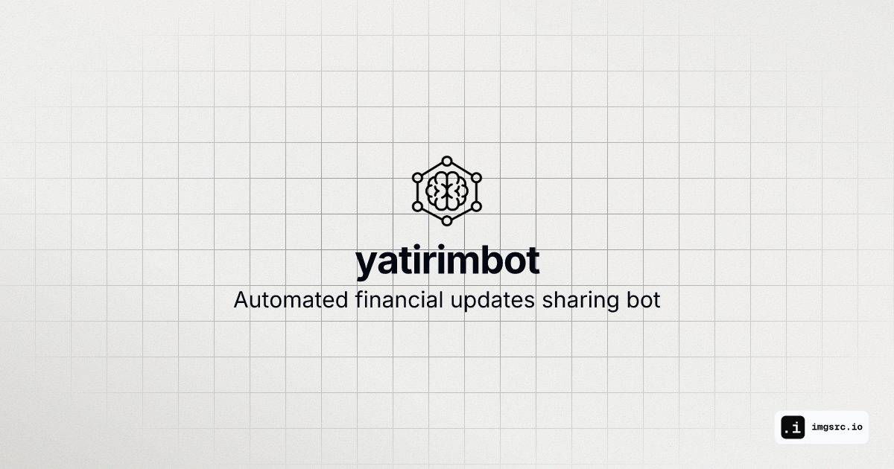

# Yatırım Bot | @yatirimhaberi | 2024
[](https://github.com/chetanraj/awesome-github-badges) [](https://opensource.org/licenses/MIT) [](https://GitHub.com/Descite-Co/yatirimbot/pulls/) [](https://GitHub.com/Descite-Co/yatirimbot/pulls/)

[](https://x.com/yatirimhaberi)

Yatırım Bot is a Python-based project designed to automate the sharing of financial updates and trading signals on Twitter. It provides timely information about market activities, including stock prices, commodities, and cryptocurrency updates, ensuring that users stay informed about critical financial events throughout the week.

## Installation

### Install UV

1. On macOS and Linux:
```bash
curl -LsSf https://astral.sh/uv/install.sh | sh
```

2. On Windows:
```powershell
powershell -ExecutionPolicy ByPass -c "irm https://astral.sh/uv/install.ps1 | iex"
```

3. Using pip:
```bash
pip install uv
```

## Requirements

- Stable internet connection
- Accurate system time settings
- Python 3.x

## Getting Started

1. Configure Environment Variables like in [example .env](env.example):
- `EMAIL`: Email of the sender
- `PASSWORD`: Password for the sender SMTP
- `RECEIVER`: Email for the receiver of test functions

2. Run the project:
```bash
uv run main.py
```

## Operating Schedule

| Time          | Activity                                      | Frequency                |
|---------------|-----------------------------------------------|--------------------------|
| 10:17         | BIST market opening signal                    | Weekdays                 |
| 10:20         | IPO operations                                | Weekdays                 |
| 10:30         | Gold price update                             | Weekdays                 |
| 11:30         | Silver price update                           | Weekdays                 |
| 12:30         | Exchange rate update                          | Weekdays                 |
| 13:30         | Natural Gas price update                      | Weekdays                 |
| 16:00         | BIST 30 and US market opening                | Weekdays                 |
| 16:46         | BIST 30 and US market opening                | Weekdays                 |
| 16:30         | Gold price update                             | Weekdays                 |
| 18:17         | BIST market closing signal                    | Weekdays                 |
| 19:30         | BIST 30 changes                               | Weekdays                 |
| 20:00         | Crude Oil changes                             | Weekdays                 |
| 20:30         | BIST 30 changes                               | Weekdays                 |
| 23:16         | US market closing                             | Weekdays                 |
| 23:30         | Heating Oil price update                      | Weekdays                 |
| 06:30         | Cryptocurrency updates                        | Daily                    |
| 18:00         | Cryptocurrency updates                        | Daily                    |
| 11:00         | BIST stock operations based on timing        | Daily                    |
| 15:00         | BIST stock operations based on timing        | Daily                    |
| 19:00         | BIST stock operations based on timing        | Daily                    |
| 17:30         | Long-term stock updates                       | Daily                    |
| 23:49         | Long-term stock updates                       | Daily                    |

## Repo Activity


## Contributing
Contributions, issues, and feature requests are welcome. Feel free to check issues page if you want to contribute.

[](https://github.com/Descite-Co/yatirimbot)

[](https://star-history.com/#Descite-Co/yatirimbot)
